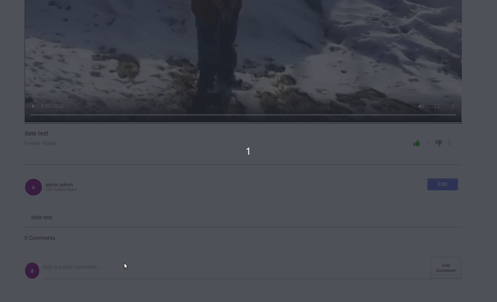

# README
RePlay
======

Replay is a video sharing website where users can upload videos and view content posted by others. Signed in users are allowed to leave comments or like a video while non-logged in users are limited to only viewing. Videos and comments are protected with user authentication to prevent users from editing/removing content that isn't theirs. The app utilizes the React-Redux cycle with a Ruby on Rails backend configuration for datebase validations. Videos and images are stored using AWS-S3 cloud-storage and the server is hosted by Heroku.


[Link to the app](https://replay-videos.herokuapp.com/#/)


***
Technologies Used
-----------------

* Backend
    - PostgreSQL
    - Ruby on Rails
* Frontend
    - React.js
    - Redux
* Storage 
    - AWS


***
Features
--------

### User authentication and validations
Implimented own authentication process to ensure proper user credentials. Features validations on the User and Session models to secure user information without storing password information. The code snippet below pairs with a session controller which tracks session cookies to validate the user is logged in on refresh.


```
    validates :password, length:{minimum: 6, allow_nil: true}
    validates :first_name, :last_name, :session_token, :password_digest, :email, presence: true
    validates :email, :session_token,  uniqueness: true
    after_initialize :ensure_session_token
    attr_reader :password

    def self.find_by_credentials(email,password)
        user = User.find_by(email: email)
        user && user.is_password?(password) ? user : nil
    end

    def self.find_by_email(email)
        user = User.find_by(email: email)
        user ? user : nil
    end

    def password=(password)
        @password = password
        self.password_digest = BCrypt::Password.create(password)
    end

    def is_password?(password)
        BCrypt::Password.new(self.password_digest).is_password?(password)
    end

    def ensure_session_token
        self.session_token ||= User.generate_session_token
    end

    def self.generate_session_token
        SecureRandom::urlsafe_base64(16)

```

### Polymorphic Associations with Likes
YouTube allows users to like both videos and comments and was replicated in this project using a polymorphic Likes table. To use this, both comments and videos featured `has_many :likes, as :likeable` and were created depending on the parameters passed in. 

```
    def create
            @user = current_user
            
        if params[:comment_id].present?
            @comment = Comment.find(params[:comment_id])
            @comment.likes.new(user_id: @user.id, liked: params[:liked])
            if @comment.save!   
                render :comment
            end

        elsif params[:video_id].present?
            @video = Video.find(params[:video_id])
            @video.likes.build(user_id: @user.id, liked: params[:liked])
            if @video.save!   
                render :video
            end
        end
    end
```
The comment_id/video_id parameter was determined using unique routes determined by which AJAX request was used. After receiving the information, the build method is used to be instantiated from the passed in attributes.




### User video upload/edit functionality

Users can post their own videos and content to their channel for others to view. Video files get submitted and then stored as a reference on AWS servers to make the content available on the cloud. Video submission forms come with error handling whenever the fields were improperly filled out. Once a video is submitted, the page will redirect to the video's show page where the user can opt to edit the video title, description, or thumbnail. The edit form also gives ability to delete the video as a whole.


